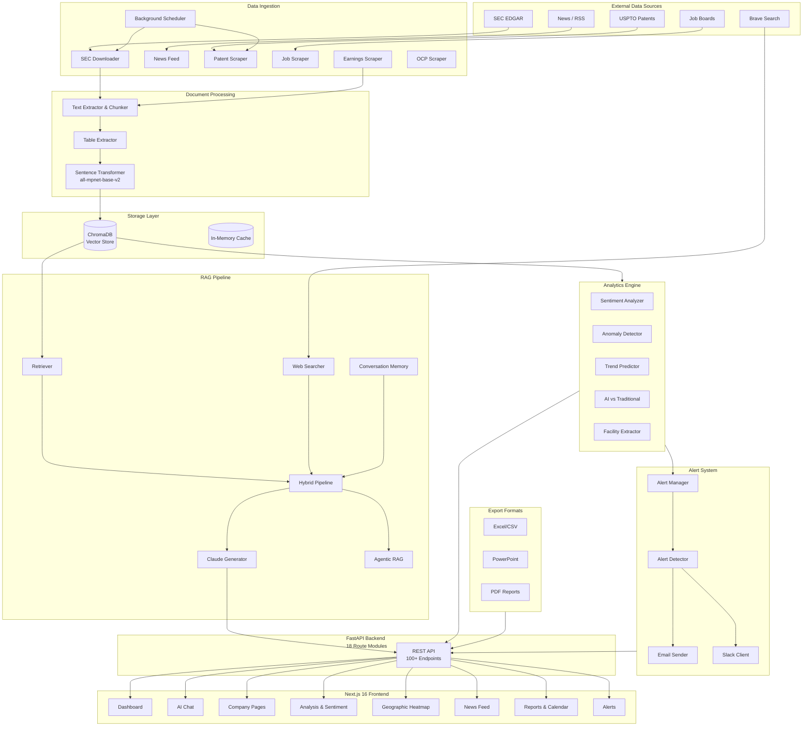
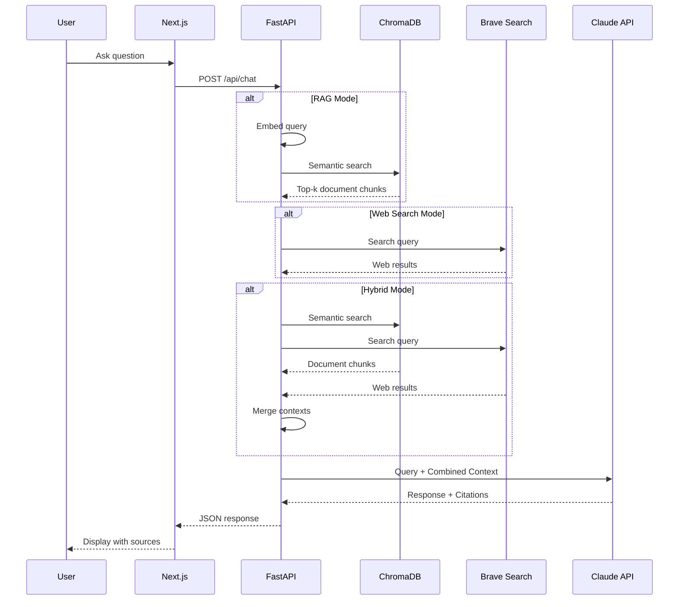
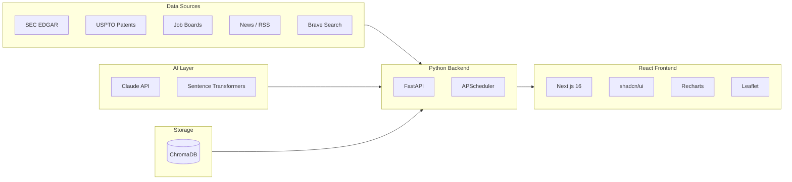

# Flex Competitive Intelligence Platform - AI Powered

> An AI-powered competitive intelligence platform for analyzing CapEx strategies of contract manufacturers using RAG, NLP, and automated data ingestion.

## Overview

| Metric | Value |
|--------|-------|
| **Target Companies** | Flex, Jabil, Celestica, Benchmark, Sanmina |
| **Documents** | ~405 files (10-K, 10-Q, earnings calls, etc.) |
| **Team Size** | 4 developers x 10 hrs/week |
| **Timeline** | 12 weeks |
| **Monthly Cost** | ~$20-50 (Claude API only) |

---

## Quick Start

```bash
# 1. Clone and enter the repo
git clone https://github.com/sjagannathan17/Flex-Practicum-Project-2026.git
cd Flex-Practicum-Project-2026

# 2. Set up API keys
cp backend/.env.example backend/.env
# Edit backend/.env with your Anthropic + Brave API keys

# 3. Set up frontend env
echo "NEXT_PUBLIC_API_URL=http://localhost:8001" > frontend/.env.local

# 4. Install dependencies
pip install -r backend/requirements.txt
cd frontend && npm install && cd ..

# 5. Start backend (Terminal 1)
python3 -m uvicorn backend.main:app --host 0.0.0.0 --port 8001

# 6. Start frontend (Terminal 2)
cd frontend && npm run dev
```

**App:** http://localhost:3000 | **API Docs:** http://localhost:8001/docs | **Health:** http://localhost:8001/api/health

> See **[SETUP.md](SETUP.md)** for detailed instructions, prerequisites, and troubleshooting.

---

## System Architecture



---

## Data Flow: Hybrid RAG + Web Search



---

## Technology Stack



### Stack Details

| Layer | Technology | Purpose | Cost |
|-------|------------|---------|------|
| Vector DB | ChromaDB | Document embeddings and semantic search | FREE |
| Cache | In-memory dict | Session memory, API response caching | FREE |
| Embeddings | all-mpnet-base-v2 | 768-dim sentence embeddings | FREE |
| LLM | Claude API | Response generation, summarization | ~$20-50/mo |
| Web Search | Brave Search API | Real-time web information | FREE tier |
| SEC Data | SEC EDGAR API | Auto-download filings | FREE |
| Patents | USPTO PatentsView | Patent tracking | FREE |
| Jobs | Web scraping | Hiring trend analysis | FREE |
| News | Brave Search / RSS | Real-time news feeds | FREE |
| Scheduler | APScheduler | Background jobs | FREE |
| Backend | FastAPI | REST API with async support | FREE |
| Frontend | Next.js 16 | React framework with App Router | FREE |
| Styling | Tailwind CSS v4 | Utility-first CSS | FREE |
| Components | shadcn/ui | Accessible UI components | FREE |
| Charts | Recharts | Composable React charts | FREE |
| Maps | Leaflet + React-Leaflet | Geographic heatmap | FREE |
| PDF Export | WeasyPrint | PDF report generation | FREE |
| Excel Export | openpyxl | Excel/CSV export | FREE |
| PPTX Export | python-pptx | PowerPoint generation | FREE |

---

## Project Structure

```
Flex-Practicum-Project-2026/
├── backend/                              # FastAPI Backend
│   ├── main.py                           # App entry point + route registration
│   ├── requirements.txt                  # Python dependencies
│   ├── .env                              # API keys (not in git)
│   ├── .env.example                      # Template for .env
│   │
│   ├── core/
│   │   ├── config.py                     # Settings, company definitions, env vars
│   │   ├── database.py                   # ChromaDB client + embedding model
│   │   └── cache.py                      # In-memory cache with TTL
│   │
│   ├── rag/                              # RAG Pipeline
│   │   ├── retriever.py                  # Vector search against ChromaDB
│   │   ├── generator.py                  # Claude API integration
│   │   ├── web_search.py                 # Brave Search integration
│   │   ├── pipeline.py                   # Hybrid RAG + Web + Memory pipeline
│   │   ├── agentic.py                    # Agentic RAG capabilities
│   │   └── memory.py                     # Conversation memory
│   │
│   ├── ingestion/                        # Data Ingestion Layer
│   │   ├── sec_downloader.py             # SEC EDGAR filing downloader
│   │   ├── earnings_scraper.py           # Earnings call transcripts
│   │   ├── patent_scraper.py             # USPTO patent filings
│   │   ├── job_scraper.py                # Job posting scraper
│   │   ├── news_aggregator.py            # News aggregation
│   │   ├── news_feed.py                  # News feed API routes
│   │   ├── ocp_scraper.py                # OCP (Open Compute) scraper
│   │   ├── processor.py                  # Text extraction & chunking
│   │   └── scheduler.py                  # APScheduler for background jobs
│   │
│   ├── analytics/                        # Analytics Engine
│   │   ├── sentiment.py                  # Sentiment analysis (Claude-powered)
│   │   ├── anomaly.py                    # CapEx anomaly detection
│   │   ├── trends.py                     # Trend prediction
│   │   ├── classifier.py                 # AI vs Traditional investment classifier
│   │   ├── facility_extractor.py         # Facility location extraction
│   │   ├── geographic.py                 # Geographic analysis
│   │   └── table_extractor.py            # PDF/HTML table extraction
│   │
│   ├── alerts/                           # Alert System
│   │   ├── alert_manager.py              # Alert management & persistence
│   │   ├── detector.py                   # Alert trigger detection
│   │   ├── email_sender.py               # SendGrid email notifications
│   │   └── slack_client.py               # Slack notifications
│   │
│   ├── exports/                          # Export Generators
│   │   ├── excel.py                      # Excel/CSV export (openpyxl)
│   │   ├── powerpoint.py                 # PPTX generation (python-pptx)
│   │   └── pdf.py                        # PDF report generation
│   │
│   ├── reports/                          # Reports & Scheduling
│   │   ├── auto_summarizer.py            # Auto-summarize new filings
│   │   ├── calendar.py                   # Earnings calendar management
│   │   └── scheduler.py                  # Report scheduling
│   │
│   └── api/routes/                       # API Route Definitions
│       ├── chat.py                       # /api/chat — AI chat with RAG
│       ├── companies.py                  # /api/companies — company list & details
│       ├── company_detail.py             # /api/company/{name} — deep-dive
│       ├── analysis.py                   # /api/analysis — CapEx analysis
│       ├── analytics.py                  # /api/analytics — anomalies, trends
│       ├── dashboard.py                  # /api/dashboard — dashboard data
│       ├── sentiment.py                  # /api/sentiment — sentiment analysis
│       ├── geographic.py                 # /api/geographic — facility maps
│       ├── financials.py                 # /api/financials — financial data
│       ├── earnings.py                   # /api/earnings — earnings calendar
│       ├── ingestion.py                  # /api/ingestion — SEC filing status
│       ├── alerts.py                     # /api/alerts — alert management
│       ├── exports.py                    # /api/exports — file exports
│       ├── advanced_data.py              # /api/patents, /api/jobs, /api/ocp
│       └── reports.py                    # /api/summaries, /api/calendar
│
├── frontend/                             # Next.js 16 Frontend
│   ├── src/
│   │   ├── app/                          # App Router Pages
│   │   │   ├── layout.tsx                # Root layout + sidebar navigation
│   │   │   ├── page.tsx                  # Home / landing page
│   │   │   ├── dashboard/page.tsx        # Analytics dashboard
│   │   │   ├── chat/page.tsx             # AI chat interface
│   │   │   ├── companies/page.tsx        # Company list
│   │   │   ├── companies/[company]/      # Company deep-dive
│   │   │   ├── compare/page.tsx          # Side-by-side comparison
│   │   │   ├── analysis/page.tsx         # CapEx analysis
│   │   │   ├── analytics/page.tsx        # Advanced analytics
│   │   │   ├── sentiment/page.tsx        # Sentiment timeline
│   │   │   ├── heatmap/page.tsx          # Geographic heatmap
│   │   │   ├── map/page.tsx              # Facility map
│   │   │   ├── news/page.tsx             # News feed
│   │   │   ├── data/page.tsx             # Data explorer
│   │   │   ├── reports/page.tsx          # Report generation
│   │   │   ├── calendar/page.tsx         # Earnings calendar
│   │   │   ├── alerts/page.tsx           # Alert management
│   │   │   └── settings/page.tsx         # Settings & configuration
│   │   │
│   │   ├── components/
│   │   │   ├── layout/Sidebar.tsx        # Navigation sidebar
│   │   │   ├── map/LeafletMap.tsx         # Leaflet map component
│   │   │   └── ui/                       # shadcn/ui components
│   │   │       ├── avatar.tsx
│   │   │       ├── badge.tsx
│   │   │       ├── button.tsx
│   │   │       ├── card.tsx
│   │   │       ├── input.tsx
│   │   │       ├── scroll-area.tsx
│   │   │       ├── separator.tsx
│   │   │       ├── skeleton.tsx
│   │   │       └── tabs.tsx
│   │   │
│   │   └── lib/
│   │       ├── api.ts                    # Backend API client
│   │       └── utils.ts                  # Utility functions
│   │
│   ├── package.json
│   └── .env.local                        # Frontend config (not in git)
│
├── Vector Database/
│   └── build_chromadb.py                 # ChromaDB embedding pipeline
│
├── chromadb_store/                       # Vector database (built locally, not in git)
├── data/                                 # Downloaded data (SEC filings, news, etc.)
│
├── Flex/                                 # Flex SEC filings (HTML)
├── Jabil/                                # Jabil SEC filings (PDF)
├── Celestica/                            # Celestica filings (PDF)
├── benchmark/                            # Benchmark filings (HTM)
├── Sanmina/                              # Sanmina filings (PDF)
│
├── SETUP.md                              # Detailed setup guide for teammates
└── README.md                             # This file
```

---

## API Endpoints

Full interactive API docs available at **http://localhost:8001/docs** when the backend is running.

### Chat

| Endpoint | Method | Purpose |
|----------|--------|---------|
| `/api/chat` | POST | RAG query with Claude (RAG / Web / Hybrid modes) |
| `/api/chat/stream` | POST | Streaming chat response |
| `/api/chat/sessions` | GET | List chat sessions |
| `/api/chat/sessions/{id}` | GET | Get session details |
| `/api/chat/sessions/{id}/history` | GET | Get conversation history |

### Companies

| Endpoint | Method | Purpose |
|----------|--------|---------|
| `/api/companies` | GET | List all 5 tracked companies |
| `/api/companies/{ticker}` | GET | Company details by ticker |
| `/api/companies/{ticker}/filings` | GET | Company filing documents |
| `/api/companies/compare/{tickers}` | GET | Compare multiple companies |
| `/api/company/{name}/overview` | GET | Company deep-dive overview |
| `/api/company/{name}/filings` | GET | Filing breakdown |
| `/api/company/{name}/capex` | GET | CapEx analysis |
| `/api/company/{name}/ai-analysis` | GET | AI investment analysis |
| `/api/company/{name}/geographic` | GET | Facility locations |
| `/api/company/{name}/news` | GET | Company news |

### Analysis & Analytics

| Endpoint | Method | Purpose |
|----------|--------|---------|
| `/api/analysis/overview` | GET | Dashboard metrics overview |
| `/api/analysis/capex` | GET | CapEx data across companies |
| `/api/analysis/ai-investments` | GET | AI investment analysis |
| `/api/analytics/anomalies` | GET | All detected anomalies |
| `/api/analytics/trends` | GET | Trend predictions |
| `/api/analytics/classification` | GET | AI vs Traditional classification |
| `/api/analytics/dashboard` | GET | Full analytics dashboard data |

### Sentiment

| Endpoint | Method | Purpose |
|----------|--------|---------|
| `/api/sentiment/company/{name}` | GET | Sentiment analysis for a company |
| `/api/sentiment/compare` | GET | Compare sentiment across companies |
| `/api/sentiment/trend/{name}` | GET | Sentiment trend over time |
| `/api/sentiment/ai-focus` | GET | AI investment focus comparison |
| `/api/sentiment/dashboard` | GET | Sentiment dashboard data |

### Geographic

| Endpoint | Method | Purpose |
|----------|--------|---------|
| `/api/geographic/facilities` | GET | All company facilities |
| `/api/geographic/heatmap` | GET | Heatmap data for all companies |
| `/api/geographic/facilities/{name}` | GET | Facilities for one company |
| `/api/geographic/discoveries` | GET | Newly discovered locations |

### Dashboard

| Endpoint | Method | Purpose |
|----------|--------|---------|
| `/api/dashboard/quick` | GET | Quick dashboard summary |
| `/api/dashboard/full` | GET | Full dashboard with all data |
| `/api/dashboard/company/{name}` | GET | Single company dashboard |

### News & Earnings

| Endpoint | Method | Purpose |
|----------|--------|---------|
| `/api/news/company/{ticker}` | GET | News for a company |
| `/api/news/industry` | GET | Industry-wide news |
| `/api/earnings/calendar` | GET | Earnings calendar |
| `/api/earnings/company/{ticker}` | GET | Company earnings info |
| `/api/earnings/upcoming` | GET | Upcoming earnings dates |

### Advanced Data (Patents, Jobs, OCP)

| Endpoint | Method | Purpose |
|----------|--------|---------|
| `/api/patents/{company}` | GET | Patent filings for a company |
| `/api/patents/compare/all` | GET | Patent comparison across companies |
| `/api/jobs/{company}` | GET | Job postings for a company |
| `/api/jobs/compare/all` | GET | Hiring comparison across companies |
| `/api/ocp/{company}` | GET | Open Compute involvement |
| `/api/intelligence/{company}` | GET | Combined intelligence report |

### Exports

| Endpoint | Method | Purpose |
|----------|--------|---------|
| `/api/exports/excel/{company}` | GET | Download Excel report |
| `/api/exports/excel/comparison/all` | GET | Download comparison Excel |
| `/api/exports/powerpoint/{company}` | GET | Download PowerPoint report |
| `/api/exports/pdf/{company}` | GET | Download PDF report |

### Alerts & Ingestion

| Endpoint | Method | Purpose |
|----------|--------|---------|
| `/api/alerts` | GET | List all alerts |
| `/api/alerts/check` | POST | Check for new alerts |
| `/api/alerts/summary` | GET | Alert summary |
| `/api/ingestion/status` | GET | Ingestion job status |
| `/api/ingestion/check-filings` | POST | Manually trigger SEC check |

---

## Company CIKs (SEC EDGAR)

| Company | CIK | Ticker |
|---------|-----|--------|
| Flex | 0000866374 | FLEX |
| Jabil | 0000898293 | JBL |
| Celestica | 0001030894 | CLS |
| Benchmark | 0001080020 | BHE |
| Sanmina | 0000897723 | SANM |

---

## Environment Variables

### Backend (`backend/.env`)

```bash
# REQUIRED — Claude API (~$20-50/month)
ANTHROPIC_API_KEY=sk-ant-...

# OPTIONAL — Brave Web Search (FREE tier: 2,000 queries/month)
BRAVE_API_KEY=BSA...

# SEC Scraper (FREE — just needs User-Agent)
SEC_USER_AGENT=CapExIntel/1.0 (your@email.com)

# Scheduler (Cron format: 4 PM ET, weekdays)
INGESTION_SCHEDULE=0 16 * * 1-5
```

### Frontend (`frontend/.env.local`)

```bash
NEXT_PUBLIC_API_URL=http://localhost:8001
```

---

## Cost Summary

| Service | Monthly Cost |
|---------|--------------|
| Claude API | ~$20-50 |
| Everything else | $0 |
| **Total** | **~$20-50** |

---

## Frontend Pages

| Page | URL | Description |
|------|-----|-------------|
| Dashboard | `/dashboard` | Overview with charts, metrics, company summaries |
| AI Chat | `/chat` | Ask questions — AI answers using SEC filings |
| Companies | `/companies` | Browse all 5 tracked companies |
| Company Detail | `/companies/[name]` | Deep-dive into a single company |
| Compare | `/compare` | Side-by-side company comparison |
| Analysis | `/analysis` | CapEx analysis and data |
| Analytics | `/analytics` | Anomalies, trends, classification |
| Sentiment | `/sentiment` | Sentiment analysis over time |
| Heatmap | `/heatmap` | Geographic facility map |
| Map | `/map` | Interactive Leaflet map |
| News | `/news` | Latest news for tracked companies |
| Data | `/data` | Data explorer |
| Reports | `/reports` | Generate PDF/Excel/PPTX reports |
| Calendar | `/calendar` | Earnings calendar |
| Alerts | `/alerts` | Alert management and history |
| Settings | `/settings` | Ingestion and configuration |

---

## License

This project is for educational and research purposes only.

---

## Contact

Project Team: SCU Flex Practicum 2026
