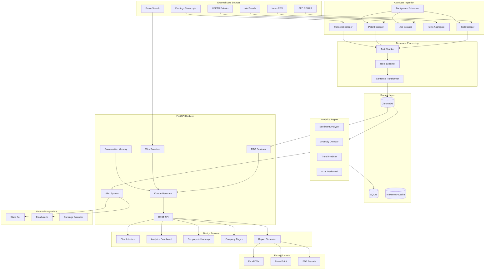
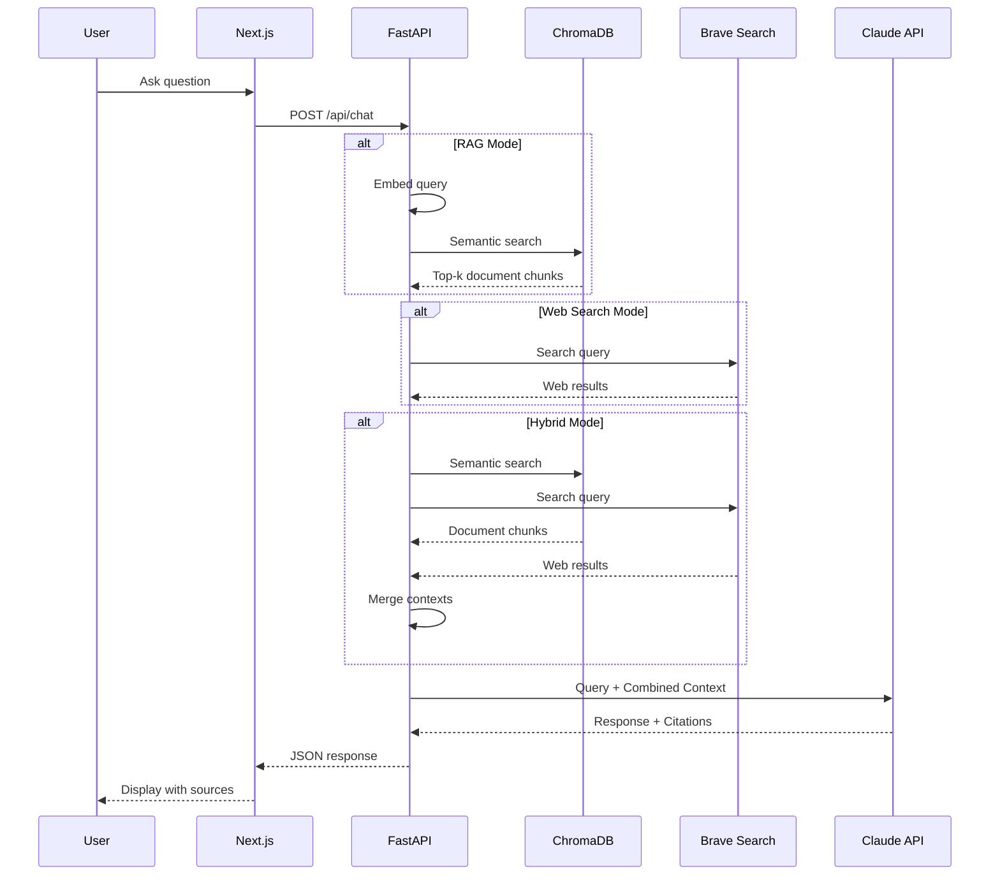
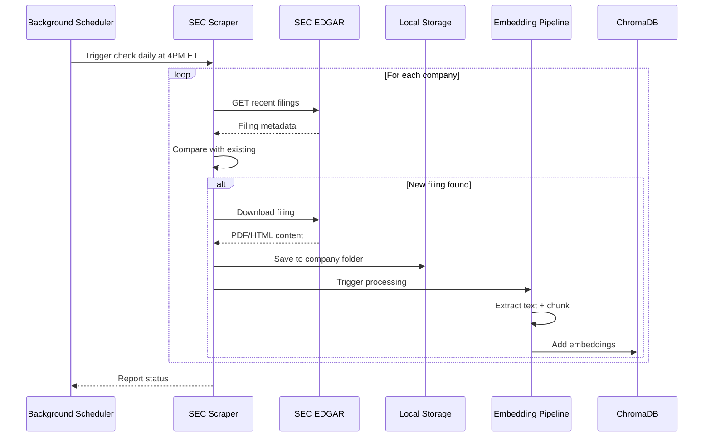
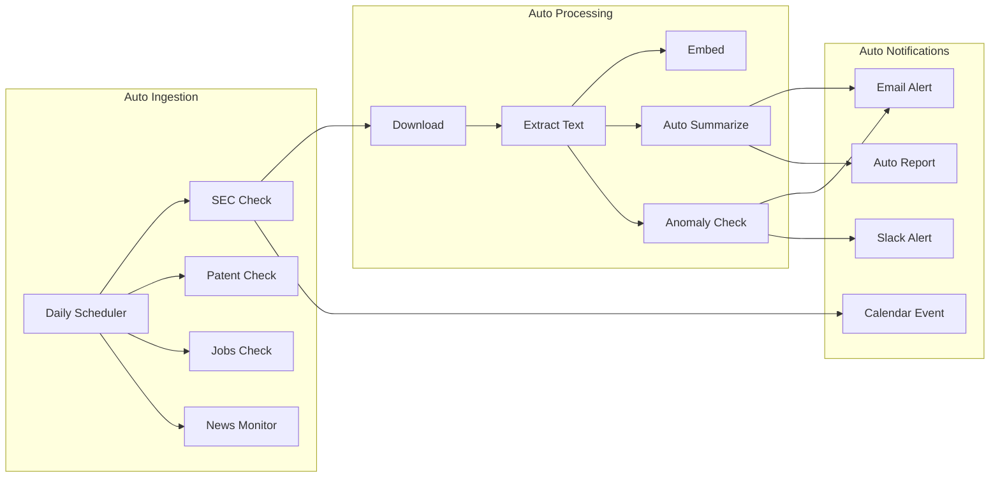
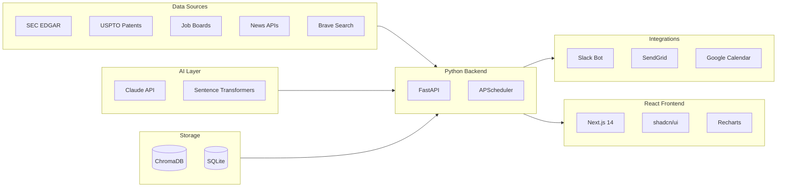
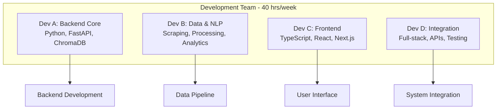
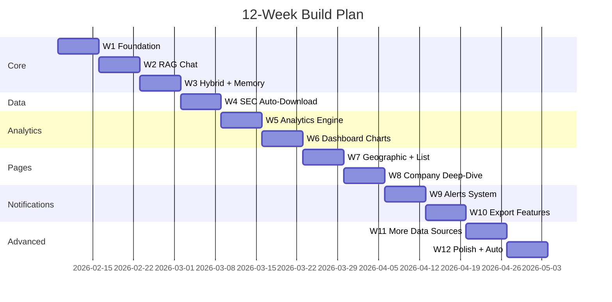
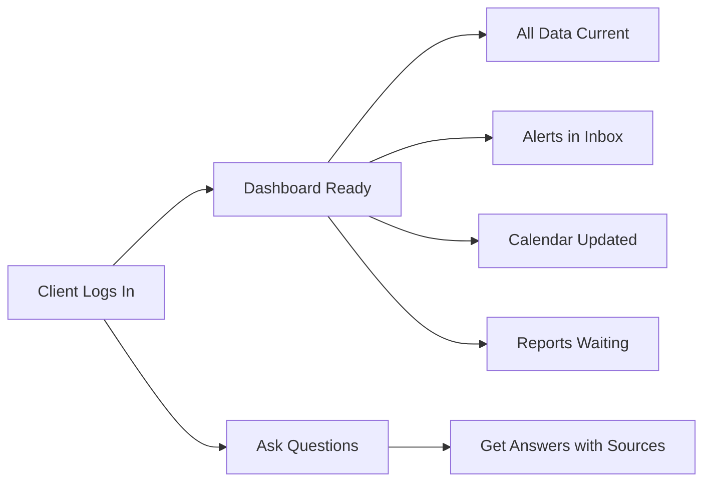

# Flex Competitive Intelligence Platform - AI Powered

> An AI-powered competitive intelligence platform for analyzing CapEx strategies of contract manufacturers using RAG, NLP, and automated data ingestion.

## Overview

| Metric | Value |
|--------|-------|
| **Target Companies** | Flex, Jabil, Celestica, Benchmark, Sanmina |
| **Documents** | ~405 files (10-K, 10-Q, earnings calls, etc.) |
| **Team Size** | 4 developers × 10 hrs/week |
| **Timeline** | 12 weeks |
| **Monthly Cost** | ~$20-50 (Claude API only) |

---

## Quick Start

```bash
# 1. Clone and enter the repo
git clone https://github.com/sjagannathan17/Flex-Practicum-Project-2026.git
cd Flex-Practicum-Project-2026

# 2. Create .env file with your API keys
echo "ANTHROPIC_API_KEY=your_key_here" > .env
echo "BRAVE_API_KEY=your_key_here" >> .env

# 3. Install dependencies
pip install -r requirements.txt
cd frontend && npm install && cd ..

# 4. Start backend (Terminal 1)
python3 -m uvicorn backend.main:app --host 0.0.0.0 --port 8001

# 5. Start frontend (Terminal 2)
cd frontend && npm run dev
```

**Access:** http://localhost:3000

> See [SETUP.md](SETUP.md) for detailed instructions and troubleshooting.

---

## System Architecture



---

## Data Flow: Hybrid RAG + Web Search



---

## Data Flow: Auto-Download SEC Filings



---

## Automation Flow



---

## Technology Stack



### Stack Details

| Layer | Technology | Purpose | Cost |
|-------|------------|---------|------|
| Vector DB | ChromaDB | Document embeddings and semantic search | FREE |
| Relational DB | SQLite | Structured data, analytics, alerts | FREE |
| Cache | In-memory dict | Session memory, conversation history | FREE |
| Embeddings | all-mpnet-base-v2 | 768-dim sentence embeddings | FREE |
| LLM | Claude API | Response generation, summarization | ~$20-50/mo |
| Web Search | Brave Search API | Real-time web information | FREE tier |
| SEC Data | SEC EDGAR API | Auto-download filings | FREE |
| Patents | USPTO PatentsView | Patent tracking | FREE |
| Jobs | Web scraping | Hiring trend analysis | FREE |
| News | RSS feeds | Real-time news feeds | FREE |
| Scheduler | APScheduler | Background jobs | FREE |
| Backend | FastAPI | REST API with async support | FREE |
| Frontend | Next.js 14 | React framework with App Router | FREE |
| Styling | Tailwind CSS | Utility-first CSS | FREE |
| Components | shadcn/ui | Accessible UI components | FREE |
| Charts | Recharts | Composable React charts | FREE |
| Maps | Leaflet + OSM | Geographic heatmap | FREE |
| Email | SendGrid | Email notifications | FREE tier |
| Chat | Slack Bot | Slack integration | FREE |
| Calendar | Google Calendar API | Auto-sync earnings dates | FREE |
| PDF Export | WeasyPrint | PDF report generation | FREE |
| Excel Export | openpyxl | Excel/CSV export | FREE |
| PPTX Export | python-pptx | PowerPoint generation | FREE |

---

## Project Structure

```
SCU Flex Practicum 2026/
├── backend/                          # FastAPI Backend
│   ├── main.py                       # FastAPI app entry
│   ├── requirements.txt              # Python dependencies
│   ├── .env                          # API keys
│   │
│   ├── core/
│   │   ├── config.py                 # Settings & company metadata
│   │   ├── database.py               # ChromaDB + SQLite clients
│   │   ├── memory.py                 # In-memory session cache
│   │   └── scheduler.py              # APScheduler for background jobs
│   │
│   ├── ingestion/                    # Data Ingestion Layer
│   │   ├── sec_scraper.py            # SEC EDGAR 10-K, 10-Q, 8-K
│   │   ├── earnings_scraper.py       # Earnings call transcripts
│   │   ├── patent_scraper.py         # USPTO patent filings
│   │   ├── job_scraper.py            # LinkedIn/Indeed job postings
│   │   ├── news_aggregator.py        # RSS news feeds
│   │   ├── table_extractor.py        # PDF table/chart extraction
│   │   ├── downloader.py             # File download & storage
│   │   ├── processor.py              # Text extraction & chunking
│   │   └── jobs.py                   # Scheduled ingestion jobs
│   │
│   ├── rag/
│   │   ├── retriever.py              # Vector search
│   │   ├── web_search.py             # Brave Search integration
│   │   ├── generator.py              # Claude integration
│   │   ├── memory.py                 # Conversation memory
│   │   └── pipeline.py               # Hybrid RAG + Web + Memory
│   │
│   ├── analytics/                    # Analytics Engine
│   │   ├── sentiment.py              # Sentiment tracking over time
│   │   ├── anomaly.py                # Anomaly detection
│   │   ├── trends.py                 # Trend prediction
│   │   ├── classifier.py             # AI vs Traditional classifier
│   │   └── geographic.py             # Geographic analysis
│   │
│   ├── alerts/                       # Alert System
│   │   ├── detector.py               # Alert trigger detection
│   │   ├── email_sender.py           # Email notifications
│   │   ├── slack_client.py           # Slack notifications
│   │   └── templates/                # Alert message templates
│   │
│   ├── exports/                      # Export Generators
│   │   ├── excel.py                  # Excel/CSV export
│   │   ├── powerpoint.py             # PPTX generation
│   │   ├── pdf.py                    # PDF report generation
│   │   └── templates/                # Report templates
│   │
│   ├── integrations/                 # External Integrations
│   │   ├── slack_bot.py              # Slack bot commands
│   │   └── calendar.py               # Earnings calendar sync
│   │
│   └── api/routes/
│       ├── chat.py                   # /api/chat (with memory)
│       ├── companies.py              # /api/companies
│       ├── analysis.py               # /api/analysis
│       ├── reports.py                # /api/reports
│       ├── alerts.py                 # /api/alerts
│       ├── ingestion.py              # /api/ingestion status
│       └── slack.py                  # /api/slack webhook
│
├── frontend/                         # Next.js Frontend
│   ├── app/
│   │   ├── layout.tsx                # Root layout + sidebar
│   │   ├── page.tsx                  # Home redirect
│   │   ├── chat/page.tsx             # Chat with memory indicator
│   │   ├── dashboard/page.tsx        # Main analytics dashboard
│   │   ├── heatmap/page.tsx          # Geographic heatmap
│   │   ├── sentiment/page.tsx        # Sentiment timeline
│   │   ├── alerts/page.tsx           # Alert management
│   │   ├── companies/
│   │   │   ├── page.tsx              # Company list
│   │   │   ├── [symbol]/page.tsx     # Company deep-dive
│   │   │   └── compare/page.tsx      # Side-by-side comparison
│   │   ├── calendar/page.tsx         # Earnings calendar
│   │   ├── reports/page.tsx          # Report generation
│   │   └── settings/page.tsx         # Ingestion & alert settings
│   │
│   ├── components/
│   │   ├── layout/
│   │   │   ├── Sidebar.tsx
│   │   │   └── Header.tsx
│   │   ├── chat/
│   │   │   ├── ChatInterface.tsx
│   │   │   ├── SearchModeToggle.tsx
│   │   │   ├── MemoryIndicator.tsx
│   │   │   └── SourceCitation.tsx
│   │   ├── dashboard/
│   │   │   ├── MetricCard.tsx
│   │   │   ├── SentimentChart.tsx
│   │   │   ├── AnomalyAlert.tsx
│   │   │   └── TrendForecast.tsx
│   │   ├── charts/
│   │   │   ├── CapExTimeline.tsx
│   │   │   ├── CompanyComparison.tsx
│   │   │   ├── GeographicHeatmap.tsx
│   │   │   ├── SentimentTimeline.tsx
│   │   │   └── RiskMatrix.tsx
│   │   ├── exports/
│   │   │   ├── ExportButton.tsx
│   │   │   └── ReportBuilder.tsx
│   │   └── alerts/
│   │       ├── AlertCard.tsx
│   │       └── AlertSettings.tsx
│   │
│   └── lib/
│       ├── api.ts                    # API client
│       ├── types.ts                  # TypeScript types
│       └── hooks/
│           ├── useChat.ts            # Chat with memory
│           └── useAlerts.ts          # Real-time alerts
│
├── chromadb_store/                   # Vector database
├── data/                             # Downloaded data
│   ├── sec_filings/
│   ├── earnings_transcripts/
│   ├── patents/
│   ├── job_postings/
│   └── news/
│
├── Flex/                             # Existing data - 27 HTML files
├── Jabil/                            # Existing data - 84 PDF files
├── Celestica/Celestica/              # Existing data - 77 files
├── benchmark/                        # Existing data - 111 files
├── Sanmina/                          # Existing data - 106 files
└── Vector Database/
    └── build_chromadb.py             # ChromaDB builder script
```

---

## API Endpoints

| Endpoint | Method | Purpose |
|----------|--------|---------|
| `/api/chat` | POST | RAG query with Claude (supports web search mode) |
| `/api/companies` | GET | List 5 companies |
| `/api/companies/{symbol}` | GET | Company details |
| `/api/analysis/overview` | GET | Dashboard metrics |
| `/api/analysis/capex-comparison` | GET | CapEx by company |
| `/api/analysis/sentiment` | GET | Sentiment trends |
| `/api/analysis/anomalies` | GET | Detected anomalies |
| `/api/reports/generate` | POST | Generate PDF/Excel/PPTX report |
| `/api/alerts` | GET | List alerts |
| `/api/alerts/settings` | PUT | Configure alert preferences |
| `/api/ingestion/status` | GET | Check ingestion job status |
| `/api/ingestion/trigger` | POST | Manually trigger SEC check |

---

## Team Structure



---

## 12-Week Execution Plan



### Weekly Milestones

| Week | Focus | Key Deliverable |
|------|-------|-----------------|
| 1 | Foundation | Project structure + ChromaDB populated |
| 2 | RAG Chat | Working Q&A with citations |
| 3 | Hybrid Search | RAG + Web + Memory |
| 4 | Auto-Ingest | SEC filings auto-download |
| 5 | Analytics | Sentiment + Anomaly detection |
| 6 | Dashboard | Charts with real data |
| 7 | Geographic | Heatmap + Company list |
| 8 | Deep-Dive | Company pages + Comparison |
| 9 | Alerts | Email + Slack notifications |
| 10 | Exports | PDF/Excel/PPTX |
| 11 | Data Sources | Patents, Jobs, News |
| 12 | Polish | Auto-reports + Calendar sync |

---

## Week-by-Week Task Breakdown

### Week 1: Foundation (40 hrs)

| Dev | Task | Hours | Deliverable |
|-----|------|-------|-------------|
| A | Set up backend structure, FastAPI, ChromaDB client | 10 | `backend/` folder with working FastAPI |
| B | Fix `build_chromadb.py`, process all 5 companies | 10 | ChromaDB populated with ~405 docs |
| C | Initialize Next.js, Tailwind, shadcn/ui, layout | 10 | `frontend/` with sidebar + routing |
| D | Set up .env files, API keys, project documentation | 10 | All configs ready, README updated |

### Week 2: RAG Chat (40 hrs)

| Dev | Task | Hours | Deliverable |
|-----|------|-------|-------------|
| A | Build retriever.py (embed + search ChromaDB) | 10 | Vector search working |
| B | Build generator.py (Claude API + citations) | 10 | Claude returns answers with sources |
| C | Build chat page UI (messages, input, send) | 10 | `/chat` page with message bubbles |
| D | Connect frontend to backend, test end-to-end | 10 | Full chat flow working |

### Week 3: Web Search + Memory (40 hrs)

| Dev | Task | Hours | Deliverable |
|-----|------|-------|-------------|
| A | Build web_search.py (Brave API integration) | 10 | Web search returns results |
| B | Build hybrid pipeline (RAG + Web + merge) | 10 | Mode toggle: RAG/Web/Hybrid |
| C | Add mode toggle UI, memory indicator | 10 | UI shows search mode, context |
| D | Build conversation memory (in-memory) | 10 | Multi-turn conversations work |

### Week 4: SEC Auto-Download (40 hrs)

| Dev | Task | Hours | Deliverable |
|-----|------|-------|-------------|
| A | Build sec_scraper.py (EDGAR API) | 10 | Can fetch filing metadata |
| B | Build downloader.py + processor.py | 10 | Downloads and embeds new docs |
| C | Build settings page (ingestion controls) | 10 | `/settings` with status display |
| D | Build scheduler.py (APScheduler) | 10 | Daily 4PM check running |

### Week 5: Analytics Engine (40 hrs)

| Dev | Task | Hours | Deliverable |
|-----|------|-------|-------------|
| A | Build sentiment.py (sentiment analysis) | 10 | Sentiment scores per document |
| B | Build anomaly.py (detect CapEx spikes) | 10 | Anomaly detection working |
| C | Build dashboard layout with metric cards | 10 | `/dashboard` with placeholders |
| D | Build analysis API endpoints | 10 | `/api/analysis/*` endpoints |

### Week 6: Dashboard Charts (40 hrs)

| Dev | Task | Hours | Deliverable |
|-----|------|-------|-------------|
| A | Build trends.py (forecasting) | 10 | Trend predictions working |
| B | Build classifier.py (AI vs Traditional) | 10 | Investment classification |
| C | Build Recharts components (pie, bar, line) | 10 | Charts rendering real data |
| D | Connect dashboard to analysis endpoints | 10 | Live data in dashboard |

### Week 7: Geographic + Company Pages (40 hrs)

| Dev | Task | Hours | Deliverable |
|-----|------|-------|-------------|
| A | Build geographic.py (location extraction) | 10 | Facility locations extracted |
| B | Build table_extractor.py (PDF tables) | 10 | Financial tables parsed |
| C | Build geographic heatmap (Leaflet) | 10 | `/heatmap` with markers |
| D | Build company list page | 10 | `/companies` with cards |

### Week 8: Company Deep-Dive (40 hrs)

| Dev | Task | Hours | Deliverable |
|-----|------|-------|-------------|
| A | Build company detail API endpoints | 10 | `/api/companies/{symbol}/*` |
| B | Build earnings_scraper.py | 10 | Earnings transcripts scraped |
| C | Build company detail page with tabs | 10 | `/companies/[symbol]` page |
| D | Build comparison page | 10 | `/companies/compare` working |

### Week 9: Alerts System (40 hrs)

| Dev | Task | Hours | Deliverable |
|-----|------|-------|-------------|
| A | Build detector.py (alert triggers) | 10 | Alerts triggered on events |
| B | Build email_sender.py (SendGrid) | 10 | Email alerts sent |
| C | Build alerts page UI | 10 | `/alerts` with history |
| D | Build slack_client.py | 10 | Slack alerts working |

### Week 10: Export Features (40 hrs)

| Dev | Task | Hours | Deliverable |
|-----|------|-------|-------------|
| A | Build excel.py (openpyxl export) | 10 | Excel/CSV download working |
| B | Build powerpoint.py (python-pptx) | 10 | PPTX export working |
| C | Build reports page + preview | 10 | `/reports` with builder |
| D | Build pdf.py (WeasyPrint) | 10 | PDF reports generated |

### Week 11: Advanced Data Sources (40 hrs)

| Dev | Task | Hours | Deliverable |
|-----|------|-------|-------------|
| A | Build patent_scraper.py (USPTO) | 10 | Patent tracking working |
| B | Build job_scraper.py | 10 | Job posting analysis |
| C | Add patent/hiring tabs to company pages | 10 | New data in UI |
| D | Build news_aggregator.py (RSS) | 10 | News feeds integrated |

### Week 12: Polish + Auto Reports (40 hrs)

| Dev | Task | Hours | Deliverable |
|-----|------|-------|-------------|
| A | Build auto-summarizer for new filings | 10 | Auto-summaries generated |
| B | Build calendar.py (Google Calendar sync) | 10 | Earnings auto-synced |
| C | Build calendar page UI | 10 | `/calendar` view |
| D | Build auto-report scheduler | 10 | Weekly/monthly reports |

---

## Fully Automated Features

### Zero Manual Work for Client



### Auto Data Ingestion

| What | Automation |
|------|------------|
| SEC Filings | Daily check at 4 PM ET, auto-download and index new 10-K/10-Q/8-K |
| Earnings Transcripts | Auto-fetch after earnings calls |
| Patents | Weekly scan for new filings |
| Job Postings | Daily scrape for hiring trends |
| News | Real-time RSS monitoring |

### Auto Alerts

| Trigger | Action |
|---------|--------|
| New SEC filing detected | Email + Slack notification with summary |
| CapEx anomaly (>20% change) | Immediate alert with analysis |
| Sentiment shift detected | Alert with before/after comparison |
| New patent filed | Weekly digest email |
| Unusual hiring activity | Alert with trend chart |

### Auto Reports

| Report | Schedule |
|--------|----------|
| Weekly Intelligence Brief | Every Monday 8 AM |
| Monthly CapEx Summary | 1st of each month |
| Quarterly Competitor Analysis | After each earnings season |
| Anomaly Report | Whenever detected (instant) |

### Auto Calendar Sync

| Event | Automation |
|-------|------------|
| Upcoming earnings dates | Auto-added to Google Calendar |
| SEC filing deadlines | Calendar reminders |
| Detected events from filings | Auto-scheduled |

### Auto Summarization

| Document | Automation |
|----------|------------|
| New 10-K filing | 1-page executive summary generated |
| Earnings call transcript | Key points extracted |
| 8-K material event | Impact assessment generated |

---

## Alert Triggers

| Trigger | Condition | Priority |
|---------|-----------|----------|
| New SEC Filing | 10-K, 10-Q, 8-K detected | High |
| CapEx Anomaly | >20% change from baseline | High |
| Sentiment Shift | Score changes >0.3 | Medium |
| Keyword Match | Custom keywords in new docs | Medium |
| Hiring Spike | >50% increase in postings | Low |
| Patent Filed | New patent by competitor | Low |

---

## Company CIKs (SEC EDGAR)

| Company | CIK | Ticker |
|---------|-----|--------|
| Flex | 0000866374 | FLEX |
| Jabil | 0000898293 | JBL |
| Celestica | 0001030894 | CLS |
| Benchmark | 0001080020 | BHE |
| Sanmina | 0000897723 | SANM |

---

## Environment Variables

### Backend (.env)

```bash
# LLM (MAIN COST - ~$20-50/month)
ANTHROPIC_API_KEY=sk-ant-...

# Vector Database (FREE - local)
CHROMADB_PATH=../chromadb_store
EMBEDDING_MODEL=all-mpnet-base-v2

# Relational Database (FREE - SQLite)
DATABASE_URL=sqlite:///./flex_intel.db

# Web Search (FREE tier - 2,000 queries/month)
BRAVE_API_KEY=BSA...

# Email Alerts (FREE tier - 100 emails/day)
SENDGRID_API_KEY=SG...
ALERT_FROM_EMAIL=alerts@yourapp.com

# Slack (FREE for personal workspace)
SLACK_BOT_TOKEN=xoxb-...
SLACK_SIGNING_SECRET=...
SLACK_WEBHOOK_URL=https://hooks.slack.com/...

# Google Calendar (FREE - OAuth2)
GOOGLE_CALENDAR_CREDENTIALS=./credentials.json
GOOGLE_CALENDAR_ID=primary

# SEC Scraper (FREE - just needs User-Agent)
SEC_USER_AGENT=FlexIntel/1.0 (your@email.com)
INGESTION_SCHEDULE=0 16 * * 1-5    # 4 PM ET, weekdays

# Data Paths
DATA_DIR=../
```

### Frontend (.env.local)

```bash
NEXT_PUBLIC_API_URL=http://localhost:8000
```

---

## Cost Summary

| Service | Monthly Cost |
|---------|--------------|
| Claude API | ~$20-50 |
| Everything else | $0 |
| **Total** | **~$20-50** |

---

## Quick Start

### Prerequisites

- Python 3.9+
- Node.js 18+
- Anthropic API key (Claude)

### Backend Setup

```bash
cd backend
python -m venv venv
source venv/bin/activate  # Windows: venv\Scripts\activate
pip install -r requirements.txt
cp .env.example .env
# Edit .env with your API keys
uvicorn main:app --reload
```

### Frontend Setup

```bash
cd frontend
npm install
cp .env.example .env.local
npm run dev
```

### Build ChromaDB

```bash
cd "Vector Database"
python build_chromadb.py
```

---

## Team Coordination

1. **Daily Standup** (15 min): Quick sync on blockers
2. **Weekly Demo**: Friday - show what's working
3. **Branch Strategy**:
   - `main` - stable
   - `dev` - integration
   - `feature/*` - individual work
4. **API Contract First**: Define endpoints before building

---

## License

This project is for educational and research purposes only.

---

## Contact

Project Team: SCU Flex Practicum 2026
